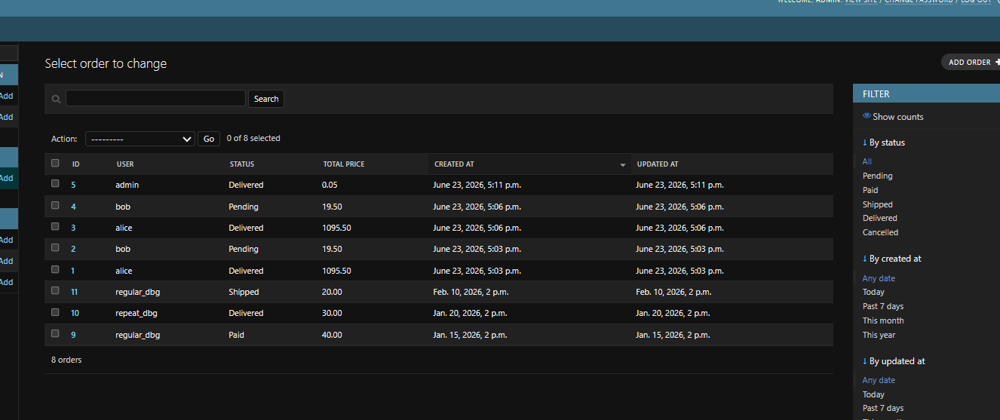

# myshop

`myshop` is a Django online store built from the requirements in [myshop/docs/PROJECT_SPEC.md](myshop/docs/PROJECT_SPEC.md). It includes a browser storefront, a session-based cart and checkout flow, a JWT-protected DRF API, Swagger/OpenAPI docs, and a staff-only GraphQL analytics endpoint.

Repository note: the actual Django project lives inside [`myshop/`](myshop/), so all local run commands below start from that directory.

## Live Demo

Public deployment:

- Main site: https://myshop-web-53xi.onrender.com
- Admin: https://myshop-web-53xi.onrender.com/admin/
- API docs: https://myshop-web-53xi.onrender.com/api/docs/
- GraphQL analytics: https://myshop-web-53xi.onrender.com/graphql/

## Main Features

- Browser storefront built with Django templates, HTMX, Alpine.js, and Tailwind CSS
- Searchable and filterable product catalog
- Product detail pages with reviews and quantity controls
- Session cart with stock validation
- Transactional checkout and order creation
- Account area with addresses and order history
- JWT-protected DRF API
- Swagger/OpenAPI documentation
- Staff-only GraphQL analytics endpoint
- PostgreSQL and Docker Compose support
- pytest coverage for catalog, cart, checkout, account, REST API, and GraphQL flows

## Quick Start

```powershell
cd myshop
python -m venv .venv
.\.venv\Scripts\Activate.ps1
pip install -r requirements.txt
Copy-Item .env.example .env
python manage.py migrate
python manage.py seed_demo_catalog
python manage.py runserver 127.0.0.1:8000
```

In a second terminal:

```powershell
cd myshop
.\.venv\Scripts\python.exe manage.py check
.\.venv\Scripts\python.exe -m pytest -v
```

Optional admin user:

```powershell
cd myshop
.\.venv\Scripts\python.exe manage.py createsuperuser
```

Keep `POSTGRES_HOST=localhost` in `.env` for local non-Docker development.

## Browser URLs

Production:

- Home: https://myshop-web-53xi.onrender.com/
- Catalog: https://myshop-web-53xi.onrender.com/products/
- Cart: https://myshop-web-53xi.onrender.com/cart/
- Checkout: https://myshop-web-53xi.onrender.com/checkout/
- Account: https://myshop-web-53xi.onrender.com/account/
- My orders: https://myshop-web-53xi.onrender.com/account/orders/
- Admin: https://myshop-web-53xi.onrender.com/admin/
- Swagger/OpenAPI: https://myshop-web-53xi.onrender.com/api/docs/
- GraphQL analytics: https://myshop-web-53xi.onrender.com/graphql/

Local:

- Home: http://127.0.0.1:8000/
- Catalog: http://127.0.0.1:8000/products/
- Product detail example: http://127.0.0.1:8000/product/stout-night/
- Cart: http://127.0.0.1:8000/cart/
- Checkout: http://127.0.0.1:8000/checkout/
- Account: http://127.0.0.1:8000/account/
- My orders: http://127.0.0.1:8000/account/orders/
- Admin: http://127.0.0.1:8000/admin/
- Swagger/OpenAPI: http://127.0.0.1:8000/api/docs/
- OpenAPI schema: http://127.0.0.1:8000/api/schema/
- GraphQL analytics: http://127.0.0.1:8000/graphql/

## Screenshots

<table>
  <tr>
    <td align="center"><br><sub>Home page</sub></td>
    <td align="center"><br><sub>Catalog page</sub></td>
    <td align="center"><br><sub>Catalog with demo products</sub></td>
  </tr>
  <tr>
    <td align="center"><br><sub>Product detail page</sub></td>
    <td align="center"><br><sub>Product reviews section</sub></td>
    <td align="center"><br><sub>Cart page</sub></td>
  </tr>
  <tr>
    <td align="center"><br><sub>Checkout page</sub></td>
    <td align="center"><br><sub>Order detail page</sub></td>
    <td align="center"><br><sub>Account page</sub></td>
  </tr>
  <tr>
    <td align="center"><br><sub>Admin product analytics</sub></td>
    <td align="center"><br><sub>Admin user analytics</sub></td>
    <td align="center"><br><sub>Django admin orders</sub></td>
  </tr>
  <tr>
    <td align="center"><br><sub>Swagger / OpenAPI</sub></td>
    <td align="center"><br><sub>GraphQL analytics UI</sub></td>
    <td align="center"><br><sub>GraphQL terminal verification</sub></td>
  </tr>
  <tr>
    <td align="center"><br><sub>Demo data seeding</sub></td>
    <td align="center"><br><sub>Docker startup</sub></td>
    <td align="center"><br><sub>pytest validation</sub></td>
  </tr>
</table>

## Demo Data Commands

Seed or refresh demo catalog data:

```powershell
cd myshop
.\.venv\Scripts\python.exe manage.py seed_demo_catalog
```

Reset catalog data and seed again:

```powershell
cd myshop
.\.venv\Scripts\python.exe manage.py seed_demo_catalog --reset
```

Full local reset:

```powershell
cd myshop
.\.venv\Scripts\python.exe manage.py flush --noinput
.\.venv\Scripts\python.exe manage.py migrate
.\.venv\Scripts\python.exe manage.py seed_demo_catalog
```

## Docker Compose

Verified project files:

- [myshop/docker-compose.yml](myshop/docker-compose.yml)
- [myshop/Dockerfile](myshop/Dockerfile)

```powershell
cd myshop
Copy-Item .env.example .env
docker compose up -d --build
docker compose run --rm web python manage.py migrate --noinput
docker compose run --rm web python manage.py seed_demo_catalog
docker compose run --rm web python manage.py createsuperuser
```

Useful follow-up commands:

```powershell
cd myshop
docker compose logs -f web
docker compose down
```

Notes:

- Docker Compose overrides `POSTGRES_HOST` to `db` for the web container
- Migrations are not run automatically on first startup
- The checked-in container serves Django on `0.0.0.0:8000`

## Test and Quality Commands

```powershell
cd myshop
.\.venv\Scripts\python.exe manage.py check
.\.venv\Scripts\python.exe -m pytest -v
.\.venv\Scripts\python.exe manage.py migrate --check
.\.venv\Scripts\python.exe -m flake8 .
.\.venv\Scripts\python.exe -m mypy .
```

## REST API and JWT

OpenAPI docs are available at `/api/docs/`, and the raw schema is available at `/api/schema/`.

JWT flow:

1. `POST /api/users/login/` with username and password
2. Send `Authorization: Bearer <access_token>` on protected endpoints
3. Refresh an expired access token with `POST /api/users/token/refresh/`

Main API areas:

- `GET /api/products/`
- `GET /api/products/<id>/`
- `GET, POST /api/products/<id>/reviews/`
- `GET, POST /api/cart/`
- `GET, POST /api/orders/`
- `GET, PATCH, DELETE /api/orders/<id>/`
- `POST /api/users/register/`
- `POST /api/users/login/`
- `POST /api/users/token/refresh/`

## GraphQL Analytics

The GraphQL analytics endpoint is available at `/graphql/`.

Access rules:

- Anonymous users are rejected
- Authenticated non-staff users are rejected
- Only staff/admin users can access analytics data

Available analytics queries include:

- `totalRevenue`
- `totalQuantitySold`
- `averageOrderValue`
- `revenueTrends(granularity: DAY | MONTH)`
- `popularProducts(limit: Int)`
- `productRevenue(limit: Int)`
- `stockBalances(limit: Int)`
- `activeUsers(limit: Int)`
- `repeatPurchasers(limit: Int)`
- `orderCountPerUser(limit: Int)`

## Project Structure

- `myshop/config/` Django settings, root URLs, ASGI, and WSGI
- `myshop/products/` catalog models, admin, forms, and browser-facing views
- `myshop/orders/` cart helpers, checkout forms, services, and order flow
- `myshop/users/` auth, profile, address models/forms/views, and account pages
- `myshop/api/` DRF serializers, API views, and REST routes
- `myshop/graphql_api/` GraphQL schema and protected endpoint view
- `myshop/templates/` Django templates and HTMX partials
- `myshop/static/` shared static assets
- `myshop/tests/` pytest-django test suite
- `myshop/docs/` specification, planning notes, and screenshots

## Specification Compliance

This repository is aligned with [myshop/docs/PROJECT_SPEC.md](myshop/docs/PROJECT_SPEC.md).

| Requirement | Status | Notes |
|---|---|---|
| Product catalog | Done | Homepage, catalog, pagination, filtering, search, and sorting are implemented. |
| Product page | Done | Detail page, ratings, add-to-cart, and review display are implemented. |
| Cart | Done | Session-backed cart supports add, update, remove, stock checks, and totals. |
| Checkout | Done | Browser checkout form, mock payment, transactional order creation, and email notifications are implemented. |
| Personal account | Done | Registration, login/logout, password change, profile editing, address management, and frontend order history are implemented. |
| Admin panel | Done | Products, categories, orders, reviews, users, and saved addresses are manageable through Django admin. |
| Admin analytics | Done | Staff-only summary cards and role-aware admin behavior are implemented. |
| REST API | Done | Products, cart, orders, users, and reviews are available through DRF. |
| JWT auth | Done | Registration, login, access token, and refresh token flows are implemented. |
| Swagger / OpenAPI | Done | `drf-spectacular` docs are available with request/response schemas. |
| GraphQL analytics | Bonus done | Staff-only analytics endpoint is implemented for orders, products, and users. |
| PostgreSQL | Done | PostgreSQL is configured as the main project database. |
| Docker Compose | Done | `docker compose` setup for app + database is included and documented. |
| Tests | Done | pytest coverage includes browser flows, API behavior, and GraphQL access rules. |
| Purchase-gated reviews | Done | Reviews are limited to authenticated purchasers in both browser and API flows. |
| Deployment link | Done | Public Render deployment is available at `https://myshop-web-53xi.onrender.com`. |
| CI/CD | Not done | Optional improvement from the original specification. |

## Deployment Status

The project is publicly deployed on Render:

https://myshop-web-53xi.onrender.com

Notes:

- The service is hosted on the Render free tier
- The first request after inactivity may take longer because the instance can spin down
- PostgreSQL is provisioned through Render
