# myshop

`myshop` is a Django online store built from the requirements in [docs/PROJECT_SPEC.md](D:/VSCode_Python_Projects_26/DjangoDRFOnlineStore_final_proj_JavaRush/myshop/docs/PROJECT_SPEC.md). It includes a browser storefront, session-based cart and checkout flow, a JWT-protected DRF API, Swagger/OpenAPI docs, and a staff-only GraphQL analytics endpoint.

## Quick Verification

Fastest path for a reviewer:

```powershell
cd D:\VSCode_Python_Projects_26\DjangoDRFOnlineStore_final_proj_JavaRush\myshop
python -m venv .venv
.\.venv\Scripts\Activate.ps1
pip install -r requirements.txt
Copy-Item .env.example .env
.\.venv\Scripts\python.exe manage.py migrate
.\.venv\Scripts\python.exe manage.py seed_demo_catalog
.\.venv\Scripts\python.exe manage.py runserver 127.0.0.1:8000
```

In a second terminal:

```powershell
cd D:\VSCode_Python_Projects_26\DjangoDRFOnlineStore_final_proj_JavaRush\myshop
.\.venv\Scripts\python.exe manage.py check
.\.venv\Scripts\python.exe -m pytest -v
```

Optional admin user:

```powershell
cd D:\VSCode_Python_Projects_26\DjangoDRFOnlineStore_final_proj_JavaRush\myshop
.\.venv\Scripts\python.exe manage.py createsuperuser
```

## Browser URLs

- Home: [http://127.0.0.1:8000/](http://127.0.0.1:8000/)
- Catalog: [http://127.0.0.1:8000/products/](http://127.0.0.1:8000/products/)
- Product detail example: [http://127.0.0.1:8000/product/stout-night/](http://127.0.0.1:8000/product/stout-night/)
- Cart: [http://127.0.0.1:8000/cart/](http://127.0.0.1:8000/cart/)
- Checkout: [http://127.0.0.1:8000/checkout/](http://127.0.0.1:8000/checkout/)
- Account: [http://127.0.0.1:8000/account/](http://127.0.0.1:8000/account/)
- My orders: [http://127.0.0.1:8000/account/orders/](http://127.0.0.1:8000/account/orders/)
- Admin: [http://127.0.0.1:8000/admin/](http://127.0.0.1:8000/admin/)
- Swagger/OpenAPI: [http://127.0.0.1:8000/api/docs/](http://127.0.0.1:8000/api/docs/)
- OpenAPI schema: [http://127.0.0.1:8000/api/schema/](http://127.0.0.1:8000/api/schema/)
- GraphQL analytics: [http://127.0.0.1:8000/graphql/](http://127.0.0.1:8000/graphql/)

## Demo Data Commands

Seed or refresh demo catalog data:

```powershell
cd D:\VSCode_Python_Projects_26\DjangoDRFOnlineStore_final_proj_JavaRush\myshop
.\.venv\Scripts\python.exe manage.py seed_demo_catalog
```

Reset catalog data and seed again:

```powershell
cd D:\VSCode_Python_Projects_26\DjangoDRFOnlineStore_final_proj_JavaRush\myshop
.\.venv\Scripts\python.exe manage.py seed_demo_catalog --reset
```

Full local reset:

```powershell
cd D:\VSCode_Python_Projects_26\DjangoDRFOnlineStore_final_proj_JavaRush\myshop
.\.venv\Scripts\python.exe manage.py flush --noinput
.\.venv\Scripts\python.exe manage.py migrate
.\.venv\Scripts\python.exe manage.py seed_demo_catalog
```

## Screenshots / Demo

### Home Page

Shows the landing page hero and featured products section.

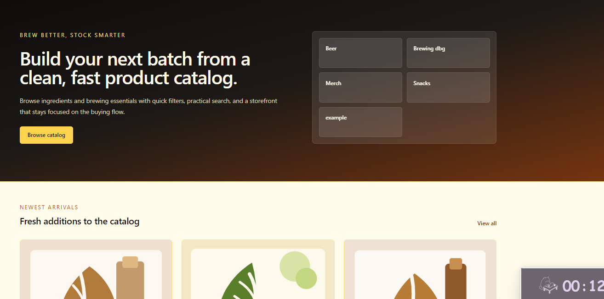

### Catalog Page

Shows filters, sorting, and product cards linking to product detail pages.

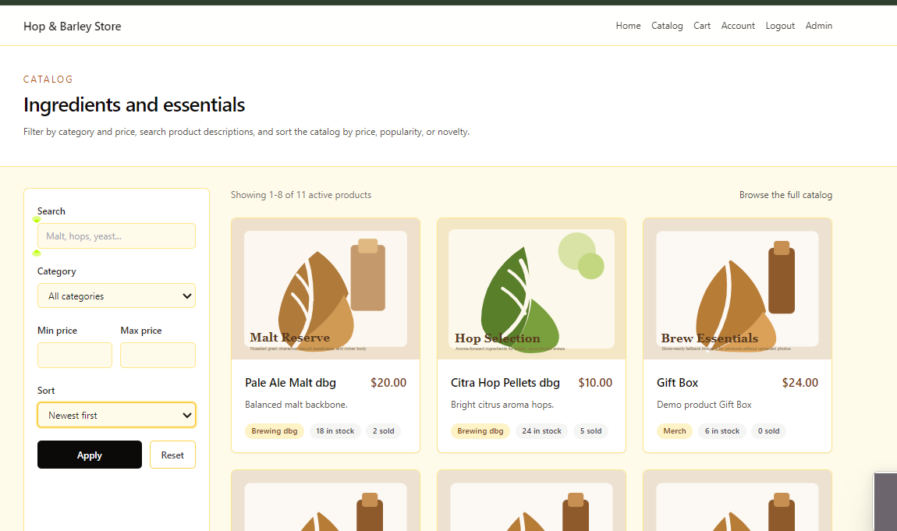

### Catalog With Varied Demo Products

Shows the seeded demo catalog with diverse placeholder/product imagery.

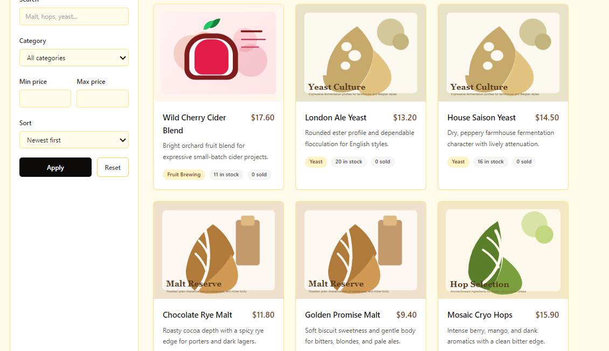

### Product Detail Page

Shows product information, quantity selection, and add-to-cart flow.

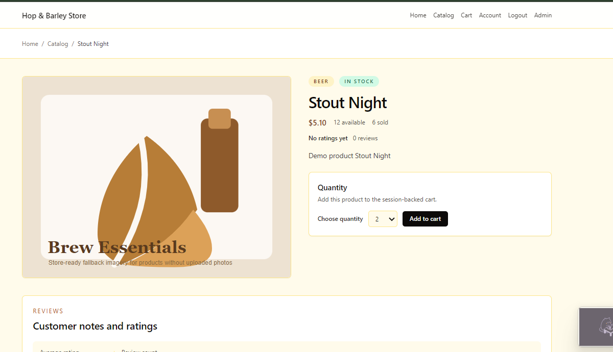

### Product Reviews Section

Shows the browser review form and rendered customer reviews.

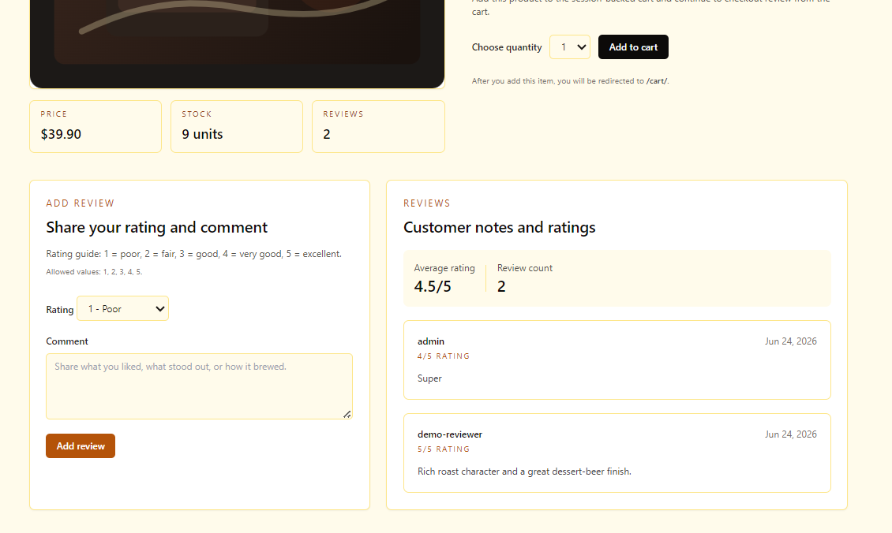

### Cart Page

Shows session cart contents, totals, and the checkout button.

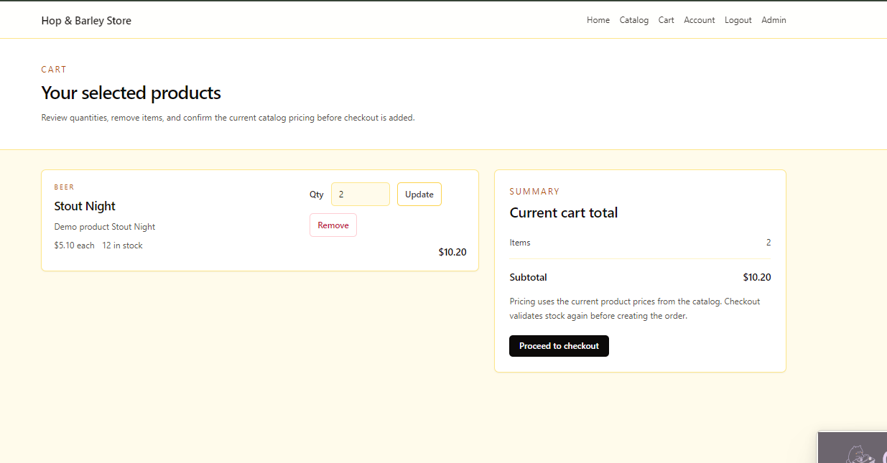

### Checkout Page

Shows delivery details, mock payment method, and the order summary.

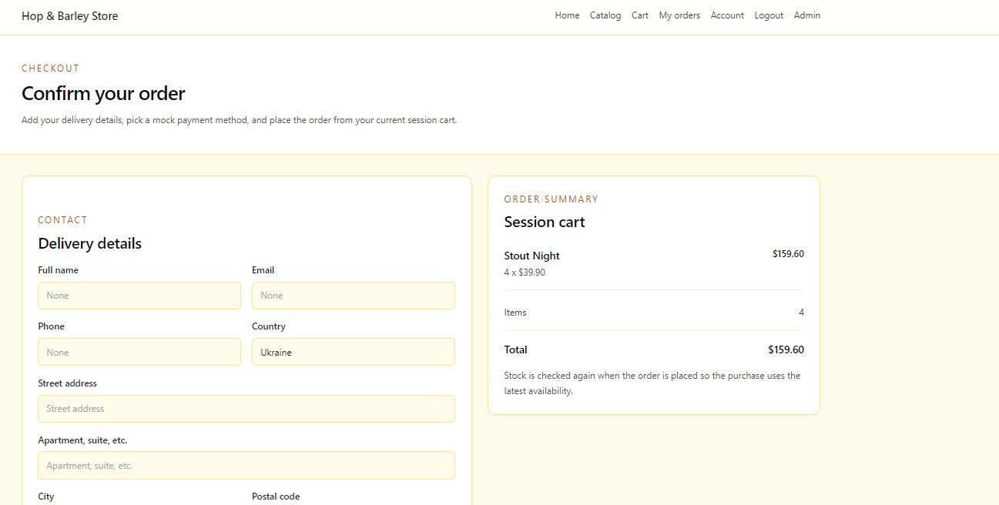

### Order Detail Page

Shows the frontend order summary and purchased items after checkout.

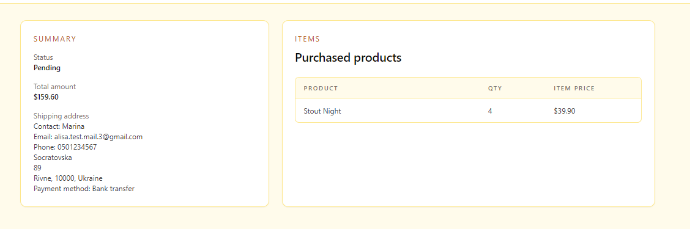

### Account Page

Shows profile editing, address management, and account overview.

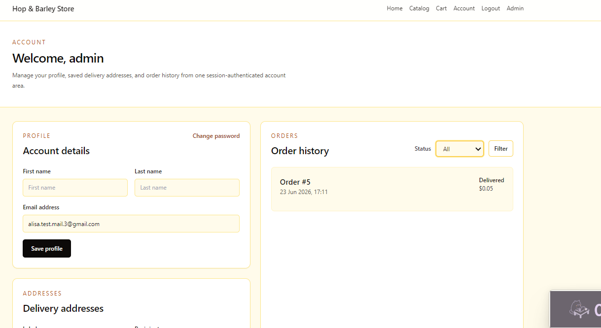

### Admin Product Analytics

Shows the Django admin product changelist with analytics summary cards and product sales columns.

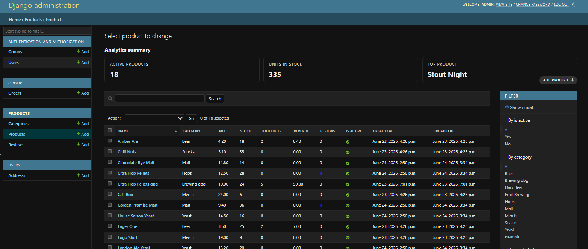

### Admin User Analytics

Shows the Django admin user changelist with registered users, staff users, and repeat purchaser summaries.

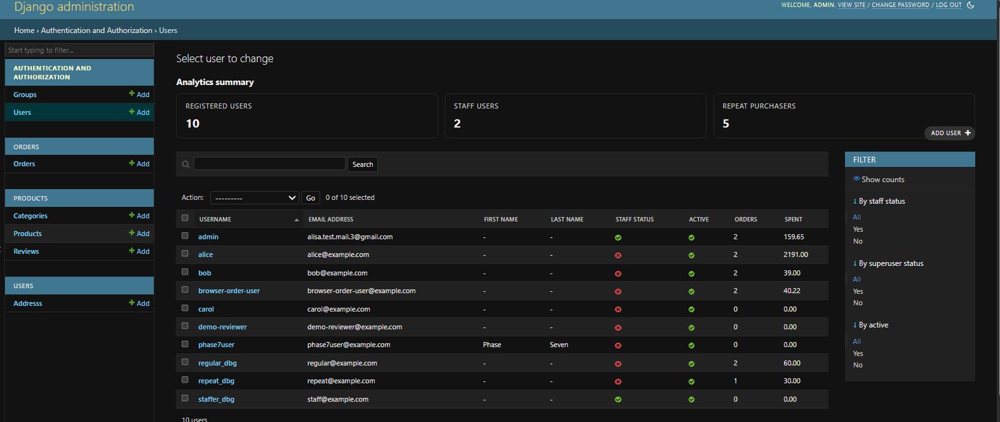

### Swagger / OpenAPI

Shows the REST API documentation interface and protected endpoints.

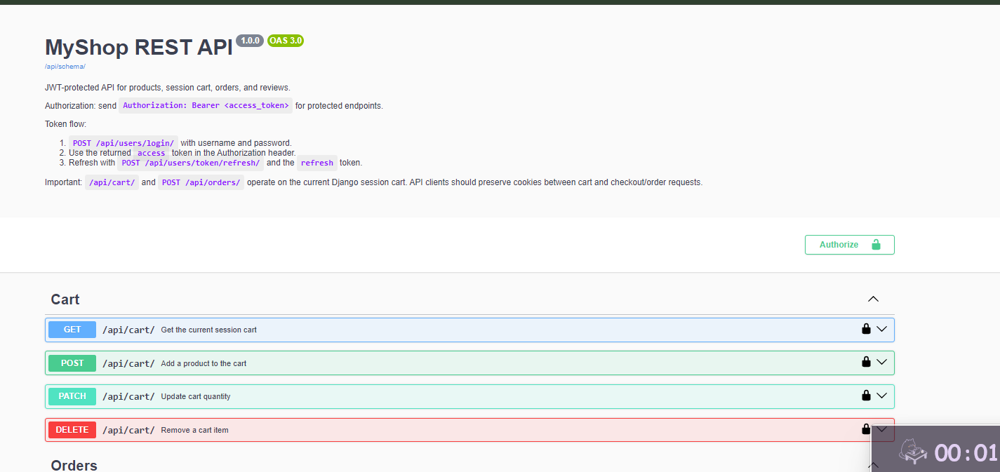

### GraphQL Analytics UI

Shows staff-only analytics queries in GraphiQL.

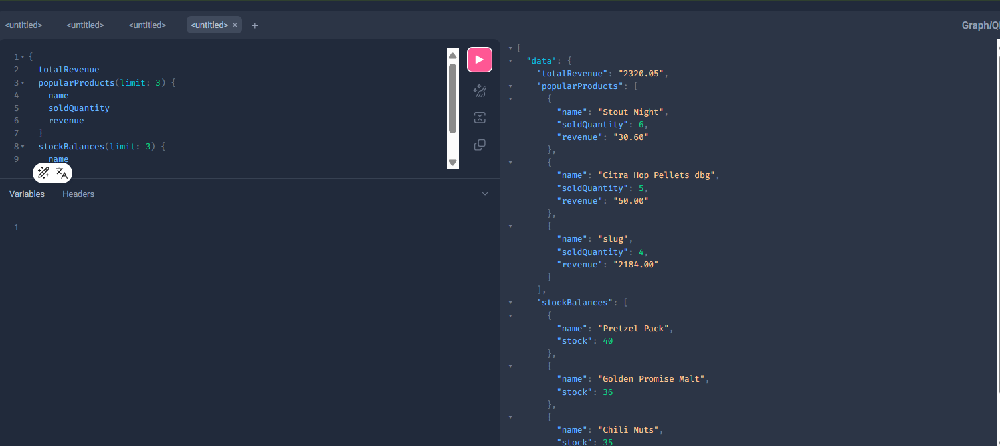

### Terminal GraphQL Verification

Shows local terminal verification of the GraphQL analytics endpoint.

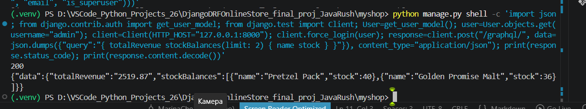

### Demo Data Command

Shows the demo catalog seeding command running successfully.

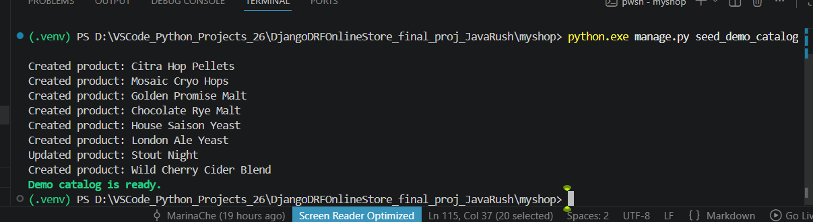

### Docker Startup

Shows the Docker Compose application and database startup.

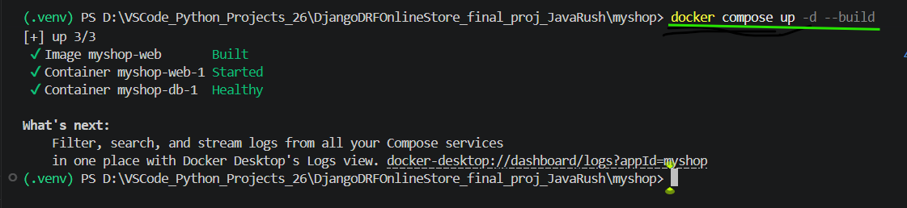

### pytest Validation

Shows a passing pytest validation run.

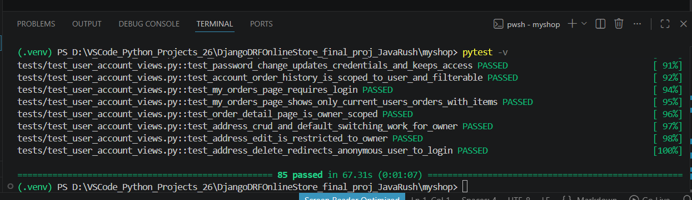

## Specification Compliance

This section compares the current repository state against [docs/PROJECT_SPEC.md](D:/VSCode_Python_Projects_26/DjangoDRFOnlineStore_final_proj_JavaRush/myshop/docs/PROJECT_SPEC.md), using [AGENTS.md](D:/VSCode_Python_Projects_26/DjangoDRFOnlineStore_final_proj_JavaRush/myshop/AGENTS.md) as the implementation/process guide.

| Requirement | Status | Notes |
|---|---|---|
| Product catalog (`/` and `/products/`) | Done | Homepage, catalog, pagination, filtering, search, sorting by price, popularity, and novelty are implemented. |
| Product page (`/product/<slug>/`) | Done | Detail page, image, price, rating display, add-to-cart, and browser reviews are implemented. Browser review submission is limited to authenticated purchasers. |
| Cart (`/cart/`) | Done | Session-backed cart supports add, update, remove, stock checks, totals, and browser messages. |
| Checkout (`/checkout/`) | Done | Browser checkout form, mock payment, transactional order creation, order items, stock validation, and email notifications are implemented. |
| Personal account (`/account/`) | Done | Registration, login/logout, password change, profile editing, address management, frontend order history, and order detail views are implemented. |
| Admin panel basics (`/admin/`) | Done | Products, categories, orders, reviews, users, and saved addresses are manageable through Django admin. |
| Admin analytics and role-specific admin rights | Done | Order, product, and user changelists include staff-only summary cards, and admin access continues to follow Django staff + model-permission rules. |
| REST API (`/api/`) | Done | Products, cart, orders, users, and reviews are available through DRF with ownership and validation rules. |
| JWT auth | Done | Registration, login, access token, and refresh token flows are implemented. |
| Swagger / OpenAPI (`/api/docs/`) | Done | drf-spectacular docs are available with JWT guidance and request examples. |
| GraphQL analytics (`/graphql/`) | Bonus done | Staff-only GraphQL analytics endpoint is implemented for orders, products, and users. |
| PostgreSQL | Done | PostgreSQL is configured as the project database target. |
| Docker Compose | Done | `docker compose` setup for app + database is documented and was used during verification. |
| Typing and docstrings | Done | Type annotations and docstrings were added across the project’s public modules and important functions. |
| Tests | Done | pytest-django coverage includes catalog, cart, checkout, account, REST API, and GraphQL analytics behavior. |
| Review submission only after purchase | Done | Enforced for both the REST API and the browser review form flow. |
| Deployment link | Not done | No real deployment link is included. Only local/Docker startup instructions and screenshot/video placeholders are documented. |
| CI/CD | Not done | Optional improvement from the spec recommendations; not implemented. |
| Modern dependency manager (`poetry`, `uv`, etc.) | Not done | `requirements.txt` is used. |
| Meaningful commit history / branch workflow | Not verified in README | This is a repository process requirement from the spec, but this README does not claim it has been formally reviewed here. |

## Main Features

- Browser storefront built with Django templates, HTMX, Alpine.js, and Tailwind CSS
- Searchable and filterable product catalog
- Product detail pages with images, reviews, and quantity controls
- Session cart with stock validation
- Transactional checkout and order creation
- Session-auth account area with addresses and order history
- JWT-protected DRF API for external clients
- Swagger/OpenAPI docs
- Staff-only GraphQL analytics endpoint

## Local Development

### Prerequisites

- Python 3.13 recommended
- PostgreSQL running locally
- A virtual environment

### Setup

```powershell
cd D:\VSCode_Python_Projects_26\DjangoDRFOnlineStore_final_proj_JavaRush\myshop
python -m venv .venv
.\.venv\Scripts\Activate.ps1
pip install -r requirements.txt
Copy-Item .env.example .env
```

Keep `POSTGRES_HOST=localhost` in `.env` for local non-Docker development.

### Run

```powershell
cd D:\VSCode_Python_Projects_26\DjangoDRFOnlineStore_final_proj_JavaRush\myshop
.\.venv\Scripts\python.exe manage.py migrate
.\.venv\Scripts\python.exe manage.py seed_demo_catalog
.\.venv\Scripts\python.exe manage.py runserver 127.0.0.1:8000
```

### Create a Superuser

```powershell
cd D:\VSCode_Python_Projects_26\DjangoDRFOnlineStore_final_proj_JavaRush\myshop
.\.venv\Scripts\python.exe manage.py createsuperuser
```

## Docker Compose

Verified project files:

- [docker-compose.yml](D:/VSCode_Python_Projects_26/DjangoDRFOnlineStore_final_proj_JavaRush/myshop/docker-compose.yml)
- [Dockerfile](D:/VSCode_Python_Projects_26/DjangoDRFOnlineStore_final_proj_JavaRush/myshop/Dockerfile)

### Docker Run Commands

```powershell
cd D:\VSCode_Python_Projects_26\DjangoDRFOnlineStore_final_proj_JavaRush\myshop
Copy-Item .env.example .env
docker compose up -d --build
docker compose run --rm web python manage.py migrate --noinput
docker compose run --rm web python manage.py seed_demo_catalog
docker compose run --rm web python manage.py createsuperuser
```

Useful follow-up commands:

```powershell
docker compose logs -f web
docker compose down
```

Notes:

- Docker Compose overrides `POSTGRES_HOST` to `db` for the web container.
- Migrations are not run automatically on first startup.
- The checked-in container serves Django on `0.0.0.0:8000`.

## Test and Quality Commands

```powershell
cd D:\VSCode_Python_Projects_26\DjangoDRFOnlineStore_final_proj_JavaRush\myshop
.\.venv\Scripts\python.exe manage.py check
.\.venv\Scripts\python.exe -m pytest -v
.\.venv\Scripts\python.exe manage.py migrate --check
.\.venv\Scripts\python.exe -m flake8 .
.\.venv\Scripts\python.exe -m mypy .
```

## REST API and JWT

OpenAPI docs are available at `/api/docs/`, and the raw schema is available at `/api/schema/`.

JWT flow:

1. `POST /api/users/login/` with username and password
2. Send `Authorization: Bearer <access_token>` on protected endpoints
3. Refresh an expired access token with `POST /api/users/token/refresh/`

### Example API Requests

Registration:

```bash
curl -X POST http://127.0.0.1:8000/api/users/register/ \
  -H "Content-Type: application/json" \
  -d "{\"username\":\"api-user\",\"password\":\"VeryStrongPass123\",\"email\":\"api-user@example.com\"}"
```

JWT login:

```bash
curl -X POST http://127.0.0.1:8000/api/users/login/ \
  -H "Content-Type: application/json" \
  -d "{\"username\":\"api-user\",\"password\":\"VeryStrongPass123\"}"
```

JWT refresh:

```bash
curl -X POST http://127.0.0.1:8000/api/users/token/refresh/ \
  -H "Content-Type: application/json" \
  -d "{\"refresh\":\"<refresh_token>\"}"
```

Product list:

```bash
curl "http://127.0.0.1:8000/api/products/?q=amber&category=extracts&min_price=10.00"
```

Add to cart:

```bash
curl -c cookies.txt -b cookies.txt -X POST http://127.0.0.1:8000/api/cart/ \
  -H "Content-Type: application/json" \
  -d "{\"product_id\":1,\"quantity\":2}"
```

Create order from the current session cart:

```bash
curl -c cookies.txt -b cookies.txt -X POST http://127.0.0.1:8000/api/orders/ \
  -H "Authorization: Bearer <access_token>" \
  -H "Content-Type: application/json" \
  -d "{\"shipping_address\":\"42 Brewery Lane, Kyiv, 02000, Ukraine\"}"
```

Create review:

```bash
curl -X POST http://127.0.0.1:8000/api/products/1/reviews/ \
  -H "Authorization: Bearer <access_token>" \
  -H "Content-Type: application/json" \
  -d "{\"rating\":5,\"comment\":\"Excellent ingredients and fast delivery.\"}"
```

Note: `/api/cart/` and `POST /api/orders/` use the current Django session cart, so API clients must preserve cookies between cart updates and order creation.

## GraphQL Analytics

The GraphQL analytics endpoint is available at `/graphql/`.

### Access Rules

- Anonymous users are rejected
- Authenticated non-staff users are rejected
- Only staff/admin users can access analytics data

### How to Access GraphiQL

1. Create a staff or superuser account
2. Sign in through the browser at `/admin/` or another session-auth page
3. Open `/graphql/` in the same browser session

### Available Queries

- `totalRevenue`
- `totalQuantitySold`
- `averageOrderValue`
- `revenueTrends(granularity: DAY | MONTH)`
- `popularProducts(limit: Int)`
- `productRevenue(limit: Int)`
- `stockBalances(limit: Int)`
- `activeUsers(limit: Int)`
- `repeatPurchasers(limit: Int)`
- `orderCountPerUser(limit: Int)`

### Example GraphQL Query

```graphql
query AnalyticsDashboard {
  totalRevenue
  totalQuantitySold
  averageOrderValue
  popularProducts(limit: 5) {
    name
    soldQuantity
    revenue
    stock
    imageUrl
  }
  stockBalances(limit: 5) {
    name
    stock
  }
}
```

### Local GraphQL Verification

Browser:

- Sign in as a staff/admin user
- Open [http://127.0.0.1:8000/graphql/](http://127.0.0.1:8000/graphql/)
- Paste the example query and run it in GraphiQL

Terminal:

```powershell
cd D:\VSCode_Python_Projects_26\DjangoDRFOnlineStore_final_proj_JavaRush\myshop
.\.venv\Scripts\python.exe manage.py shell -c "import json; from django.contrib.auth import get_user_model; from django.test import Client; User=get_user_model(); user=User.objects.get(username='admin'); client=Client(HTTP_HOST='127.0.0.1:8000'); client.force_login(user); response=client.post('/graphql/', data=json.dumps({'query':'{ totalRevenue stockBalances(limit: 2) { name stock } }'}), content_type='application/json'); print(response.status_code); print(response.content.decode())"
```

## Project Structure

- `config/` Django settings, root URLs, ASGI, and WSGI
- `products/` catalog models, admin, views, forms, and browser-facing product pages
- `orders/` cart helpers, checkout forms, order services, and browser order flow
- `users/` session auth, profile, address models/forms/views, and account pages
- `api/` DRF serializers, API views, and REST routes
- `graphql_api/` GraphQL analytics schema and protected endpoint view
- `templates/` Django templates and HTMX partials
- `static/` shared static assets
- `media/` uploaded media for development
- `tests/` pytest-django test suite
- `scripts/` helper scripts including validation
- `docs/` specification, planning notes, screenshots, and acceptance-tracking documents

## Implementation Checklist

- `[x]` PostgreSQL configuration exists
- `[x]` Docker Compose configuration exists
- `[x]` Catalog, search, sorting, filters, and pagination are implemented
- `[x]` Product detail page is implemented
- `[x]` Session cart and stock validation are implemented
- `[x]` Browser checkout and order creation are implemented
- `[x]` Browser registration, login, account pages, and address management are implemented
- `[x]` Frontend order history and order detail pages are implemented
- `[x]` REST API with JWT authentication is implemented
- `[x]` Swagger/OpenAPI documentation is implemented
- `[x]` GraphQL analytics endpoint is implemented for staff/admin use
- `[x]` Demo data seeding command exists
- `[x]` Tests, flake8, and mypy are configured
- `[x]` Admin analytics and role-based admin hardening are implemented
- `[x]` Purchase-gated browser review submission is implemented
- `[ ]` Final deployment link is not assigned yet

## Render Deployment Prep

The project is not publicly deployed yet. It is prepared for Render deployment and can be run locally with Docker.

Checked-in deployment support:

- [render.yaml](D:/VSCode_Python_Projects_26/DjangoDRFOnlineStore_final_proj_JavaRush/myshop/render.yaml) provisions a web service and PostgreSQL database
- `gunicorn` is configured as the production app server
- WhiteNoise serves collected static files in production
- `config/settings.py` accepts `DATABASE_URL`, Render hostnames, and CSRF trusted origins from environment variables

Typical Render flow:

1. Push the repository to GitHub.
2. Create a new Blueprint on Render and select the repo.
3. Let Render apply `render.yaml`.
4. Set any remaining environment values that you want to override, such as `DJANGO_ALLOWED_HOSTS` or `DJANGO_CSRF_TRUSTED_ORIGINS`.
5. Open the deployed site, run `python manage.py migrate` from the Render shell if needed, and create a superuser.

## Deployment or Video Placeholder

No fake deployment link is provided.

- Deployment URL: `TBD`
- Demo video URL: `TBD`

Suggested video/demo flow:

1. Show `docker compose up -d --build`
2. Show `python manage.py migrate` and `python manage.py seed_demo_catalog`
3. Walk through home, catalog, product detail, cart, checkout, orders, and admin
4. Show `/api/docs/` and one JWT-protected API request
5. Show `/graphql/` as a staff/admin user
6. Show `python manage.py check` and `pytest -v`

## Notes

- `docs/PROJECT_SPEC.md` is the functional source of truth.
- `AGENTS.md` is used as the implementation/process guide, not as the product requirements source.
- Product images use uploaded files when available and fall back to local placeholder artwork.
